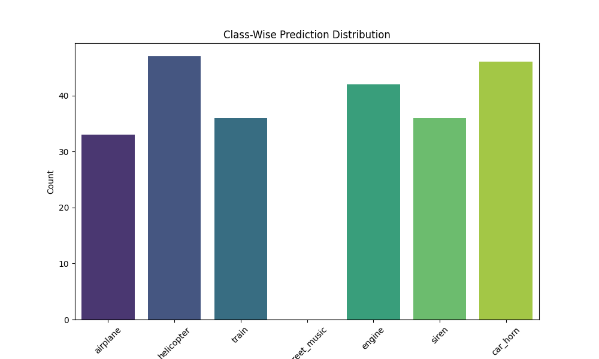
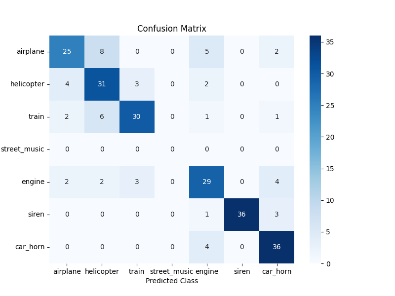
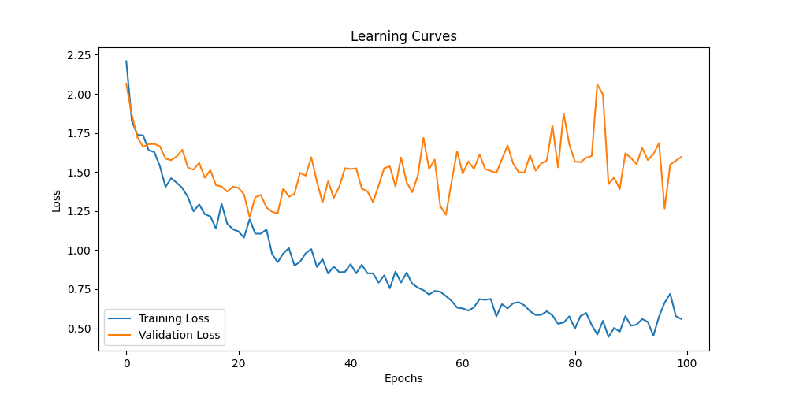

# Sound Classification Using CNN on ESC-50 Dataset

## Project Overview
This project utilizes a Convolutional Neural Network (CNN) to classify audio samples from the ESC-50 dataset into predefined urban sound classes. The aim is to demonstrate effective audio classification using neural networks, including training, validation, and inference phases, and integrate data visualization and performance metrics to analyze results.

## Dataset
The ESC-50 dataset is a collection of 2,000 environmental audio recordings equally distributed among 50 classes. For this project, a subset of 7 urban sound classes was selected:

- Airplane
- Helicopter
- Train
- Street Music
- Engine
- Siren
- Car Horn

Each audio sample is preprocessed into Mel spectrograms for input into the CNN model.

## Project Components
### Data Preparation
- **Dataset Loading**: Utilized the ESC-50 dataset, filtering for the selected classes.
- **Preprocessing**: Applied Mel Spectrogram transformation with normalization.
- **Data Splitting**: Split into training (80%) and validation (20%) sets.

### Model Construction
- **CNN Architecture**: Built a deep learning model with four convolutional layers, max pooling, dropout layers, and fully connected layers for classification.
- **Training Parameters**:
  - Batch size: 32
  - Epochs: 500
  - Learning rate: 0.001

### Training
- **Loss Function**: Cross-Entropy Loss
- **Optimizer**: Adam optimizer with learning rate scheduling using ReduceLROnPlateau.
- **Training and Validation**: Monitored loss and accuracy over epochs using WandB for visualization.

### Inference
- Implemented inference pipeline to test the trained model on unseen data.
- Added visualizations, including:
  - **Class Distribution Histogram**
  - **Confusion Matrix**
  - **Sample Spectrograms**

## Results
### Performance
- **Accuracy**: Achieved 78% accuracy on the validation set, demonstrating effective classification for most classes.

### Visualizations
#### Class-Wise Prediction Distribution


#### Confusion Matrix


#### Learning Curves


### Observations
- **Street Music**: This class was not predicted at all during inference. Analysis of the confusion matrix and histograms suggests that:
  - The model may have struggled to identify distinct features for "Street Music".
  - Insufficient samples or low representation of this class in the training data could have contributed.
  - High overlap in features between "Street Music" and other urban sounds, such as "Siren" or "Engine", might have led to misclassifications.

## Conclusion
This project highlights the effectiveness of CNNs in sound classification tasks using the ESC-50 dataset. However, the absence of predictions for "Street Music" emphasizes the importance of:
1. Ensuring balanced and adequate representation of all classes.
2. Experimenting with advanced feature extraction techniques to differentiate overlapping classes.
3. Exploring alternative architectures or regularization techniques to improve generalization.

Future work could address these limitations by fine-tuning the dataset, exploring pre-trained models, or using domain-specific audio augmentation techniques.

---

### How to Run
1. Clone the repository.
   ```bash
   git clone https://github.com/Codeexia0/Sound_Classification
   ```
2. Install the required dependencies.
   ```bash
   pip install -r requirements.txt
   ```
3. Preprocess the dataset and train the model.
   ```bash
   python train.py
   ```
4. Run inference and generate visualizations.
   ```bash
   python inference.py
   ```

### Acknowledgments
- ESC-50 Dataset: Karol J. Piczak
- WandB: Weights & Biases for experiment tracking


